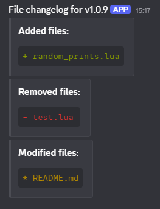
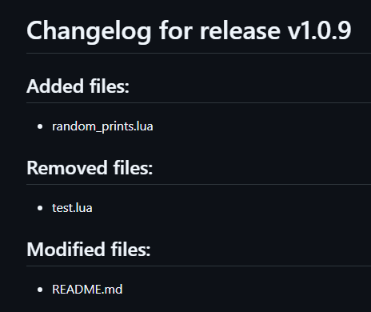

# fivem-file-changelog-action

## Description

This action is a simple system that allows creators to simplify their release workflow by not needing them to track the changed files to share them with their clients. This action will compare two separate releases, or the last release with current latest commit. Once compared it'll either send a discord webhook or save the changelog as a .txt or .md file within your repository (check the demo steps).

> <details>
>   <summary>Pictures</summary>
>
>   <p>Quick demo of it's use, it's not really intended to be sent straight to the clients but used internally</p>
>
>   
>   
> </details>


## Usage

```yml
steps:
  # Step 1: Checks out the repository code
  - name: Checkout code
    uses: actions/checkout@v4
    with:
      fetch-depth: 0 # Important: Need full history to compare releases

  # Step 2: Set up a directory for the changelog files
  - name: Create Changelog Directory
    run: mkdir -p ./changelogs

  # Step 3: Run the custom action to generate the file changelog
  - name: Generate File Changelog and Post to Discord
    uses: Maximus7474/fivem-file-changelog-action@v0.3.0
    with:
      # Optional: The webhook URL is stored securely in GitHub Secrets
      webhook: ${{ secrets.DISCORD_WEBHOOK_URL }}

      # Optional: Specify a directory to save the file
      changelog: ./changelogs

      # Optional: Use a specific filename format, referencing the release tag
      changelog_filename: ${{ github.event.release.tag_name }}.md

      # Required: Define patterns to exclude files (e.g., git files, changelogs, etc...)
      ignore_patterns: |
        .*/*|.*
        changelogs/*

  # Step 4: Upload the generated changelog file as a workflow artifact
  - name: Upload Changelog Artifact
    uses: actions/upload-artifact@v4
    with:
      name: ${{ github.event.release.tag_name }}-file-changelog
      path: ./changelogs/${{ github.event.release.tag_name }}.md
```

## Development

To install dependencies:

```bash
bun install
```

To run:

```bash
bun run index.ts
```

This project was created using `bun init` in bun v1.3.2. [Bun](https://bun.com) is a fast all-in-one JavaScript runtime.
